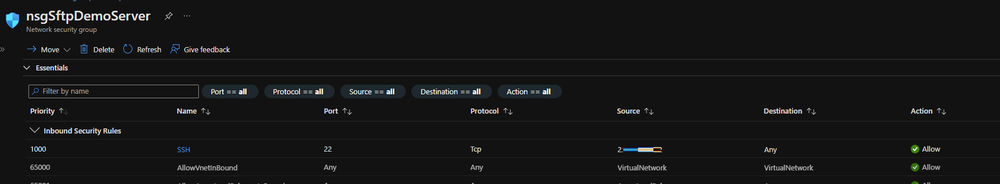

# Azure Function SFTP client with static outbound IP address

Example of how to connect to an SFTP server that has IP restrictions from Azure Functions (C#).

Uses a [NAT Gateway](https://docs.microsoft.com/en-us/azure/azure-functions/functions-how-to-use-nat-gateway) to assign a static outbound public IP address to the function app. If the target SFTP server does not restrict inbound IP addresses, the NAT Gateway is not required. 

NAT Gateway integration requires a **Premium** App Service Plan for the Function App which will incur costs.

# Setup

1. Deploy the Azure resources with `fnSftpClient.bicep`
2. Deploy the function app code in `/FunctionApp/` folder
3. Optionally deploy demo SFTP server with `vmSftpDemoServer.bicep`
4. On the target SFTP server allow the Public IP address of the NAT Gateway 
5. Call the function to test the connection to the SFTP server

See `deployment.ps1` powershell script which automates the deployment.

It requires:
- [Azure CLI](https://docs.microsoft.com/en-us/cli/azure/install-azure-cli) 
- [Functions Core Tools](https://docs.microsoft.com/en-us/azure/azure-functions/functions-run-local?tabs=v4%2Cwindows%2Ccsharp%2Cportal%2Cbash#v2)
- [.NET 6.0 SDK](https://dotnet.microsoft.com/en-us/download)

With demo server:
```
powershell .\deployment.ps1 -resourceGroupName <RESOURCE_GROUP> -location <LOCATION> -functionAppName <FUNCTIONAPP_NAME> -includeDemoServer -resourceGroupServerName <DEMO_SERVER_RESOURCE_GROUP> -sftpUsername <USERNAME> -sftpPassword <PASSWORD>
```

Without demo server:
```
powershell .\deployment.ps1 -resourceGroupName <RESOURCE_GROUP> -location <LOCATION> -functionAppName <FUNCTIONAPP_NAME> -sftpHost <SFTP_SERVER_ADDRESS> -sftpUsername <USERNAME> -sftpPassword <PASSWORD>
```

The script has a number of steps and outputs loads of text. Wait until you see 'Done!' in the powershell script output before testing anything. 

Note the outbound IP address of the NAT Gateway. This is the address you'll need to allow traffic from on the SFTP server. You can view the IP address from the Azure Portal.

For more info see [Bicep Quickstart](https://docs.microsoft.com/en-us/azure/azure-resource-manager/bicep/quickstart-create-bicep-use-visual-studio-code?tabs=CLI) and 
[Functions VS Code Quickstart](https://docs.microsoft.com/en-us/azure/azure-functions/create-first-function-vs-code-csharp?tabs=in-process)

# Run the function

Ensure the following app settings are correct in the function app config:

- SFTP_HOST
- SFTP_USERNAME
- SFTP_PASSWORD

Get the URLs for the function app from the output of the deployment templates or the Azure Portal for these functions:

1. sftpListDir - connect to the SFTP server and return a directory listing
2. ipEcho - return the outbound IP address of the function

The function URI and access codes below are examples, yours will be different.

1. sftpListDir: `https://functionAppName.azurewebsites.net/api/sftplistdir/{*directorypath}?code=slkfjsaldkfj`

Delete `{*directorypath}` and optionally replace it with the path to the directory on the SFTP server you wish to list. Call this URL in your browser and you should see the directory listing if everything's working. For example, to list the `usr` directory: `https://functionAppName.azurewebsites.net/api/sftplistdir/usr/?code=slkfjsaldkfj`

2. ipEcho: `https://functionAppName.azurewebsites.net/api/ipEcho?code=slkfjsaldkfj`

To confirm the outbound IP address the function is using, call the function ipEcho URL in your browser. The IP address returned should match the outbound IP attached to the NAT gateway.

# Demo Server

If using the demo server, you can set the allowed inbound IP address in the Network Security Group. Look for the inbound rule named SSH which should have the IP address of the NAT Gateway. Select the rule name to edit the rule and change the Source IP address to allow/deny the function app accordingly for testing:  



# Azure Storage as an SFTP service

You can also demo this by using [SFTP support for Azure Storage](https://docs.microsoft.com/en-us/azure/storage/blobs/secure-file-transfer-protocol-support-how-to?tabs=azure-portal) which is in preview. For this to work with network restrictions, the Storage account must be deployed in a [different region](https://docs.microsoft.com/en-us/azure/storage/common/storage-network-security?tabs=azure-portal#grant-access-from-an-internet-ip-range) from the Azure Function/NAT Gateway resources. 

Under the Networking blade of the Storage account, choose public access from selected networks and add the IP addess of the NAT Gateway to the allow list. 

# Clean up resources

Delete the resources for the function app client and, if you set one up, the demo server:

```
az group delete --name <RESOURCE_GROUP_NAME>
az group delete --name <DEMO_SERVER_RESOURCE_GROUP>
```
